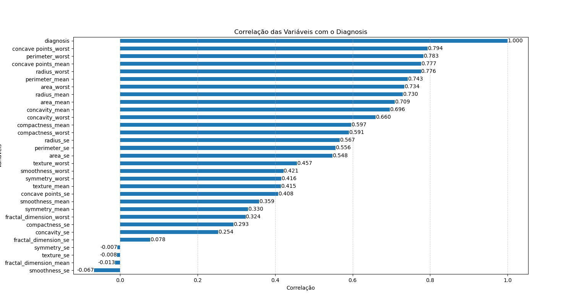
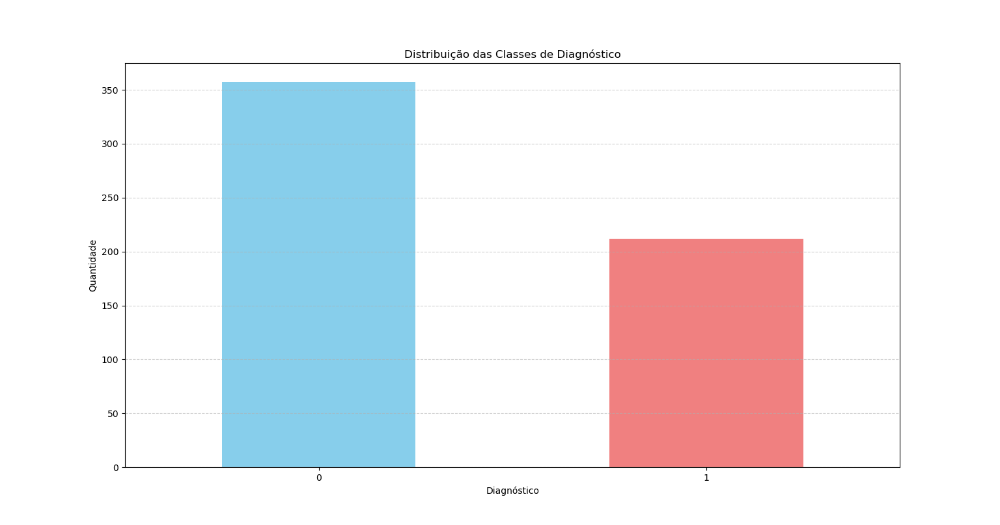
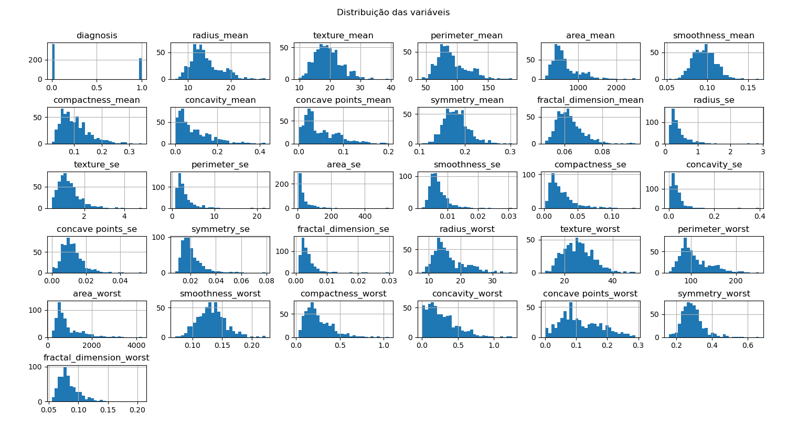

# Previsão cancer de mama: Malignos ou Benignos

Este projeto utiliza aprendizado de máquina para identificar tumores benignos e malignos com base em um conjunto de dados que contém várias características do tumor. A análise é feita com a utilização de machine learning.

# Dataset
O conjunto de dados contém variáveis relacionadas às características morfológicas de tumores de mama, incluindo medidas de raio, textura, perímetro, área, suavidade, compacidade, concavidade, pontos côncavos, simetria e dimensão fractal, calculadas a partir de imagens digitalizadas de massas mamárias.  
Classes da target: Benigno (0) e Maligno (1).  
Fonte: Kaggle

# Resultados Principais

Modelo selecionado com base em desempenho global e priorização de sensibilidade clínica. 
Recall para classe Benigna =: 91%  
Recall para classe Maligna =: 100%  
Precision para classes Benigna =: 100%  
Precision para classes Maligna =: 86%

# Modelo Selecionado
XGBOOST: Classificador binário, com ajuste de threshold baseado na curva Precision-Recall para priorizar recall da classe maligna.

# Bibliotecas e Ferramentas Utilizadas

Pandas: Para manipulação e análise de dados.  
Numpy: Para operações matemáticas e manipulação de arrays.  
Scikit-learn: Para pré-processamento de dados, como Label Encoding e One-Hot Encoding, e divisão de dados em treino e teste.  
Matplotlib: Para visualização de gráficos e métricas.  
Seaborn: Para visualização de gráficos.

# Estrutura do Projeto
``` python
Predição-cancer-de-mama
│
├── dataset/
│   ├── cancer_mama.csv  # Dataset original
│   └── dados.py         # Carregamento e manipulação dos dados
│
|── images/              # Visualizações necessarias
|
├── notebooks/
│   ├── eda.py             # Análise exploratória de dados
│   ├── preprocess.py      # split treino/teste
|   └── visualization      # visualizações
│
├── src/
│   ├── models/            # Treinamento com Modelos Diferentes(model_forest, model_keras, etc ..)
│   └── utils/             # Pasta Metrics e Predicts
|        ├── metrics/            # Metricas de todos os modelos (metrics_forest, metrics_keras, etc ..)
│        └── predict/            # Predição de todos os modelos (predict_forest, predict_keras, etc ..)
│
├── best_model/
│   ├── predicao_cancer_mama.pkl  # Melhor modelo serializado
│   └── model.py           # Lógica para escolha e exportação do melhor modelo
|
├── requirements.txt       # Bibliotecas para instalação
└── README.md              # Documentação do projeto
```

# Leitura do Dataset

O conjunto de dados foi carregado a partir de um arquivo CSV contendo características morfológicas dos tumores.
```python
dados = pd.read_csv('dataset/cancer_mama.csv')
```

# Pré-processamento

Remoção de colunas irrelevantes: id, Unnamed: 32  
Transformação da target (B = 0, M = 1)  
Split treino/teste: 60% treino / 40% teste  
Funções utilitárias para:  
Codificação de variáveis categóricas  
Visualização de correlações  
Identificação de outliers  

# Parametro do Modelo

objective='binary:logistic', 
eval_metric='auc',            
n_estimators=1000,             
learning_rate=1e-2,           
max_depth=30,               
subsample=0.5,                
colsample_bytree=0.5,         
gamma=1,                      
reg_lambda=0,                 
reg_alpha=1,           
    


# Funcionalidades
Classificação de tumores em Benigno / Maligno  
Threshold ajustável para priorizar recall clínico  
Funções de predição e cálculo de métricas (F1, AUC, precision, recall)  
Modelo serializado com joblib


# Predição
Foram implementadas funções utilitárias para cálculo de métricas e geração de previsões com threshold ajustável.


# Métricas de Avaliação do Modelo

Usando F1-score, accuracy, precision e auc como avaliação do modelo.  

AUC-ROC (Área sob a curva ROC): mede a capacidade do modelo de distinguir entre classes.  
Varia de 0 a 1, onde 1 indica um modelo perfeito

Precision (Precisão): proporção de predições positivas que estavam corretas.  
Quanto menor o falso positivo, maior a precisão.

Recall (Sensibilidade): proporção de positivos reais que foram corretamente identificados.  
#Quanto menor o falso negativo, maior o recall.

F1-Score: média harmônica entre Precision e Recall.  
Balanceia precisão e sensibilidade, útil quando as classes são desbalanceadas.

Cross Validation: [0.96491228 0.97368421 0.94690265]  
Threshold escolhido: 0.119  
AUC-ROC: 0.998  
Relatório de Classificacao:

``` python
              precision    recall  f1-score   support

           0      1.000     0.912     0.954       148
           1      0.860     1.000     0.925        80

    accuracy                          0.943       228
   macro avg      0.930     0.956     0.939       228
weighted avg      0.951     0.943     0.944       228


#Matriz de Confusão:
[[135  13]
 [  0  80]]
```

O modelo apresentou excelente desempenho, com AUC-ROC de 0.998 e validação cruzada entre 94% e 97%, indicando boa capacidade de generalização. No conjunto de teste, alcançou acurácia de 94% e recall de 100% para a classe maligna, acertando todos os positivos, o que reforça sua aplicabilidade em cenários de apoio ao diagnóstico.

# Decisão de Threshold

Em contextos médicos, falsos negativos são mais críticos que falsos positivos. Por esse motivo, o threshold foi ajustado com base na curva Precision-Recall no conjunto de treino, priorizando o recall da classe maligna.

# Tecnologias Utilizadas  
Python 3.10+  
XGBoost, RandomForest  
Pandas
Numpy
Scikit-learn  
Matplotlib
Seaborn

# Visualizações

Curva ROC  
Boxplots de variáveis  
Correlação entre variáveis e target  
Distribuição das classes  






